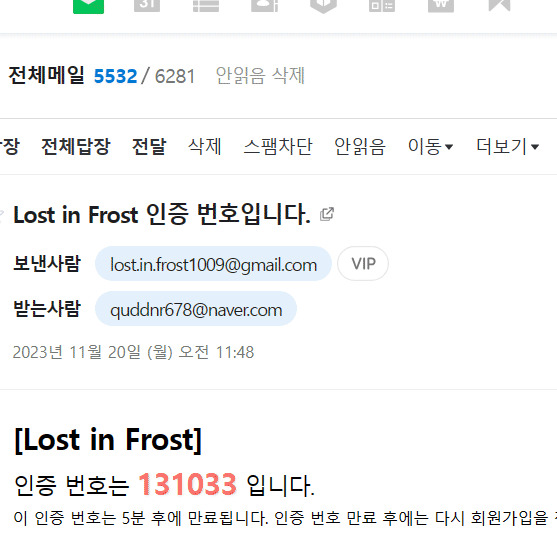
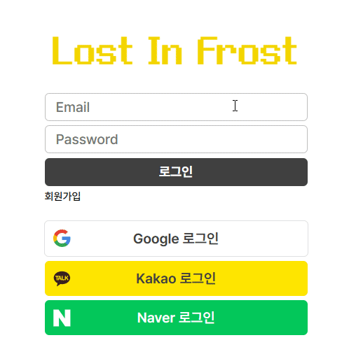

# ❄ Lost in Frost ❄

## 🎮 서비스 소개

- 평범한 생존게임은 가라! 다양한 상호작용과 랜덤 카드 선택을 통한 효과를 챙겨 30분을 버텨라!
- [게임 관련 README](https://github.com/cutepassions/Lost-in-Frost/blob/351539809cfbd53b3a7a3395308d1746046fd734/GAME.md)

## 🙍🏻‍♂️ 팀원 소개

<table align="center">
    <tr align="center">
        <td style="min-width: 150px;">
            <a href="https://github.com/imbeom35">
              
               
              <b>김범창</b>
            </a>
        </td>
        <td style="min-width: 150px;">
            <a href="https://github.com/cutepassions">
              
               
              <b>진병욱</b>
            </a>
        </td>
    </tr>
    <tr align="center">
        <td>
          김범창 [FE, 게임 런처]
        </td>
        <td>
          진병욱 [BE, CI/CD]
        </td>
    </tr>
</table>

## 📆 개발 기간
- 2023.10.09 ~ 11.17 (6주)

## 💻 사용 서버
- AWS Lightsail

## 💽 개발 환경 및 사용 기술
### Frontend
  - JavaScript, React.js

### Backend
  - Java, Spring Boot, Spring Cloud Gateway, Spring Cloud Config, Spring Batch, JPA, Querydsl
  - MySQL, Redis
  - Prometheus, Grafana
  - Nginx, Docker, Jenkins, AWS lightsail/S3
  - Git, Gitlab

## 🙋‍♂️ 나의 주요 성과

- 🔗[마이크로서비스 아키텍처(MSA) 도입](https://velog.io/@cutepassions/series/Spring-Cloud-MSA-%EC%A0%81%EC%9A%A9) (모놀리식 구조에서 MSA로 전환)
- OAuth2와 소셜 로그인 연동을 이용한 회원가입 개발 (구글, 네이버, 카카오)
- Gmail SMTP와 Redis TTL을 이용한 이메일 인증 개발
- Spring Batch를 이용하여 유저의 데이터를 가공하고, Scheduler로 실행 시간을 관리하여 랭킹 시스템 개발
- Toss API를 이용한 앱 내 테스트 결제 시스템 개발
- 🔗[Jenkins를 이용한 CI/CD 파이프라인 구축 및 서비스 배포](https://velog.io/@cutepassions/series/%EC%9B%B9-%EC%84%9C%EB%B9%84%EC%8A%A4-%EB%B0%B0%ED%8F%AC%ED%95%B4%EB%B3%B4%EA%B8%B0)

## ⚙ 아키텍처

## 💶 ERD

## 🔎 기능 소개

| 회원가입 (폼 작성)                      | 회원가입 (코드 인증)                 |
| --------------------------------------- | ------------------------------------- |
|  |  |

| 로그인                                  | 소셜 로그인                           |
| --------------------------------------- | ------------------------------------- |
|  |  |

| 런처                                   | 공지사항                              |
| --------------------------------------- | ------------------------------------- |
|            |  |

| 랭킹                                   | 전적                                 |
| --------------------------------------- | ------------------------------------- |
|            |  |

| 상점                                   | 크리스탈 결제                        |
| --------------------------------------- | ------------------------------------- |
|            |  |

| 마이페이지                             |                                       |
| --------------------------------------- | ------------------------------------- |
|  |                                       |

## 아쉬웠던 점
빠른 시간내에 비교적 적은 인원으로 프로젝트를 진행해야 하다 보니, 놓쳤던 부분들도 많았고, 사소한 부분들을 크게 신경쓰지 못했습니다.

추후에 시간을 따로 가져, 개인적으로 프로젝트를 리뷰하며 개선이 필요한 점들을 개선해 나갈 예정입니다.

## 개선 사항

### 사용자 인증 구조 개선

- 이슈 : [✔ FEATURE: Redis를 활용한 refresh token 관리 #7](https://github.com/cutepassions/Lost-in-Frost/issues/7)
- 포스트 : [Redis와 쿠키를 활용한 JWT 관리](https://velog.io/@cutepassions/series/Redis%EC%99%80-%EC%BF%A0%ED%82%A4%EB%A5%BC-%ED%99%9C%EC%9A%A9%ED%95%9C-JWT-%EA%B4%80%EB%A6%AC)

### 랭킹 시스템 배치 작업 최적화 (진행중)
- 이슈 : [✔ FEATURE: 기존 배치 작업에 대한 코드 리팩토링 및 성능 개선 #13](https://github.com/cutepassions/Lost-in-Frost/issues/13)