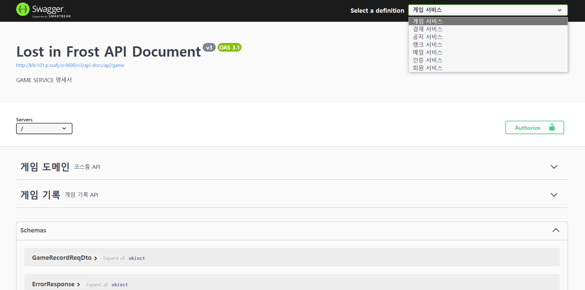
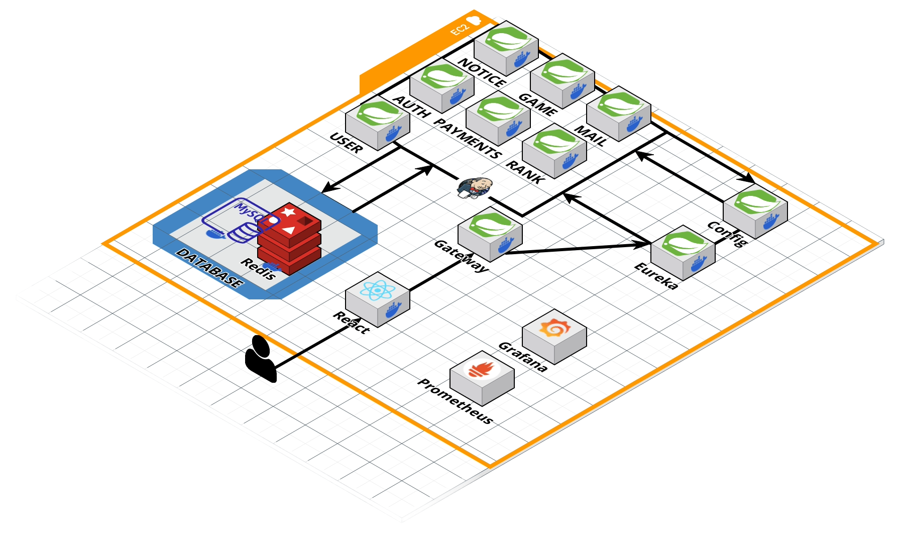
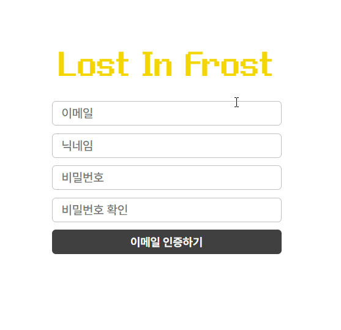

# ❄ Lost in Frost ❄

## 🎮 서비스 소개

- 평범한 생존게임은 가라! 다양한 상호작용과 랜덤 카드 선택을 통한 효과를 챙겨 30분을 버텨라!
- [게임 관련 README](https://github.com/cutepassions/Lost-in-Frost/blob/351539809cfbd53b3a7a3395308d1746046fd734/GAME.md)

## 🙍🏻‍♂️ 팀원 소개

### 프론트엔드

<table align="center">
    <tr align="center">
        <td style="min-width: 150px;">
            <a href="https://github.com/imbeom35">
              
               
              <b>김범창</b>
            </a>
        </td>
    </tr>
    <tr align="center">
        <td>
          김범창 [FE, 게임 런처]
        </td>
    </tr>
</table>

### 백엔드

<table align="center">
    <tr align="center">
        <td style="min-width: 150px;">
            <a href="https://github.com/cutepassions">
              
               
              <b>진병욱</b>
            </a>
        </td>
    </tr>
    <tr align="center">
        <td>
          진병욱 [BE, CI/CD]
        </td>
    </tr>
</table>

## 📆 개발 기간

- 2023.10.09 ~ 11.17 (6주)

## 💻 사용 서버

- AWS Lightsail ($80)

## 💽 개발 환경

### Frontend

- React

### Backend

- Spring Boot
- Spring Cloud

### CI/CD

- Xshell
- nano

### API 문서

- Swagger
  

## 📜 사용 기술 및 라이브러리

### Frontend

- WebPack, Axios, Justand

### Backend

- JAVA
- SpringBoot, SprinSecurity, JWT
- OAuth2 (GOOGLE, NAVER, KAKAO), TossAPI
- Spring Cloud, RabbitMQ, Prometheus, Grafana
- Mysql, Redis

### CI/CD

- Nginx
- Docker
- Jenkins

## ⚙ 아키텍처

## 💶 ERD

## 🔎 기능 소개

|                              회원가입 (폼 작성)                              |
| :--------------------------------------------------------------------------: |
|  |

|                                회원가입 (코드 인증)                                 |
| :---------------------------------------------------------------------------------: |
|  |

|                                   로그인                                    |
| :-------------------------------------------------------------------------: |
|  |

|                                       소셜 로그인                                        |
| :--------------------------------------------------------------------------------------: |
|  |

|                                런처                                |
| :----------------------------------------------------------------: |
|  |

|                                  공지사항                                  |
| :------------------------------------------------------------------------: |
|  |

|                                랭킹                                |
| :----------------------------------------------------------------: |
|  |

|                                전적                                |
| :----------------------------------------------------------------: |
|  |

|                                상점                                |
| :----------------------------------------------------------------: |
|  |

|                                    크리스탈 결제                                     |
| :----------------------------------------------------------------------------------: |
|  |

|                                   마이페이지                                   |
| :----------------------------------------------------------------------------: |
|  |

