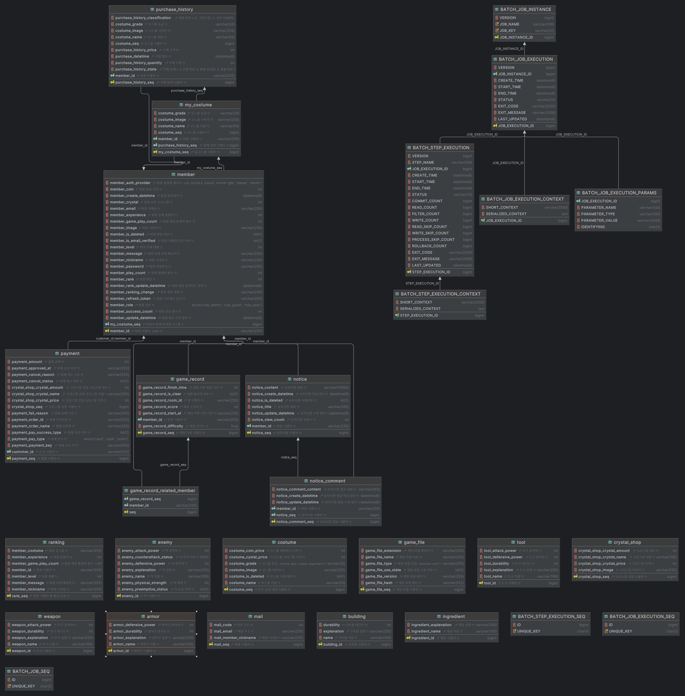

# ❄ Lost in Frost ❄

### 🎮 서비스 소개

- 평범한 생존게임은 가라! 다양한 상호작용과 랜덤 카드 선택을 통한 효과를 챙겨 30분을 버텨라!
- [게임 관련 README](https://github.com/cutepassions/Lost-in-Frost/blob/351539809cfbd53b3a7a3395308d1746046fd734/GAME.md)

### 🙍🏻‍♂️ 팀원 소개

<table align="center">
    <tr align="center">
        <td style="min-width: 150px;">
            <a href="https://github.com/imbeom35">
              
               
              <b>김범창</b>
            </a>
        </td>
        <td style="min-width: 150px;">
            <a href="https://github.com/cutepassions">
              
               
              <b>진병욱</b>
            </a>
        </td>
    </tr>
    <tr align="center">
        <td>
          김범창 [FE, 게임 런처]
        </td>
        <td>
          진병욱 [BE, CI/CD]
        </td>
    </tr>
</table>

### 📆 개발 기간
- 2023.10.09 ~ 11.17 (6주)

### 💻 사용 서버
- AWS Lightsail

### 💽 개발 환경 및 사용 기술
- Frontend
    - JavaScript, React.js
- Backend
    - Java, Spring Boot, Spring Cloud Gateway, Spring Cloud Config, Spring Batch, JPA, Querydsl
    - MySQL, Redis
    - Prometheus, Grafana
    - Nginx, Docker, Jenkins, AWS lightsail/S3
    - Git, Gitlab

### ⚙ 아키텍처

### 💶 ERD

### 🔎 기능 소개

|                              회원가입 (폼 작성)                              |
| :--------------------------------------------------------------------------: |
|  |

|                                회원가입 (코드 인증)                                 |
| :---------------------------------------------------------------------------------: |
|  |

|                                   로그인                                    |
| :-------------------------------------------------------------------------: |
|  |

|                                       소셜 로그인                                        |
| :--------------------------------------------------------------------------------------: |
|  |

|                                런처                                |
| :----------------------------------------------------------------: |
|  |

|                                  공지사항                                  |
| :------------------------------------------------------------------------: |
|  |

|                                랭킹                                |
| :----------------------------------------------------------------: |
|  |

|                                전적                                |
| :----------------------------------------------------------------: |
|  |

|                                상점                                |
| :----------------------------------------------------------------: |
|  |

|                                    크리스탈 결제                                     |
| :----------------------------------------------------------------------------------: |
|  |

|                                   마이페이지                                   |
| :----------------------------------------------------------------------------: |
|  |

### 아쉬웠던 점
빠른 시간내에 비교적 적은 인원으로 프로젝트를 진행해야 하다 보니, 놓쳤던 부분들도 많았고, 사소한 부분들을 크게 신경쓰지 못했습니다.

추후에 시간을 따로 가져, 개인적으로 프로젝트를 리뷰하며 개선이 필요한 점들을 개선해 나갈 예정입니다.

### 개선 사항

#### 사용자 인증 구조 개선

- 관련 링크
  - 이슈 : [✔ FEATURE: Redis를 활용한 refresh token 관리 #7](https://github.com/cutepassions/Lost-in-Frost/issues/7)
  - 포스팅 : [Redis와 쿠키를 활용한 JWT 관리](https://velog.io/@cutepassions/series/Redis%EC%99%80-%EC%BF%A0%ED%82%A4%EB%A5%BC-%ED%99%9C%EC%9A%A9%ED%95%9C-JWT-%EA%B4%80%EB%A6%AC)